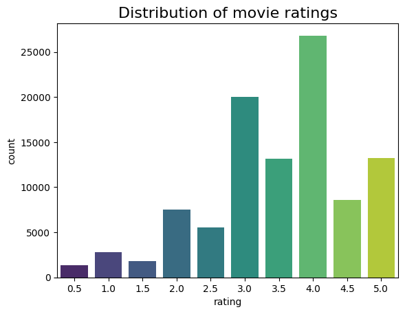
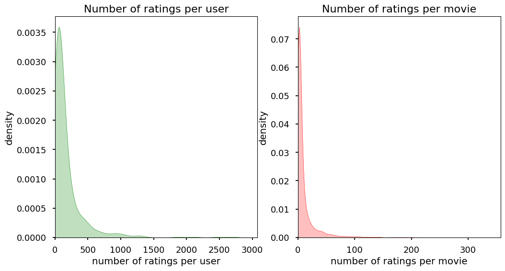
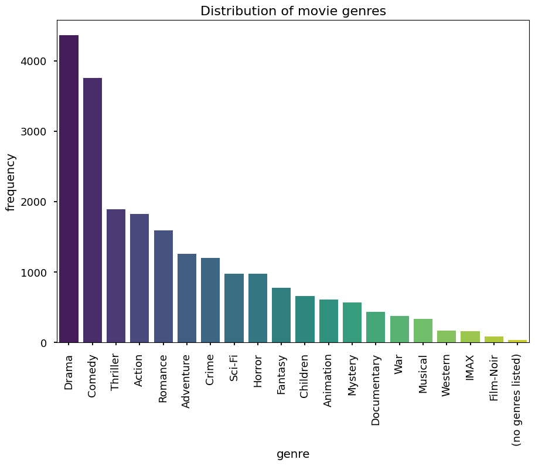

# Recommender

A Movie recommendation system using collaborative filtering and content based filtering. In this project, we use the MovieLens Dataset and follow the tutorial [here][Video_tutorial]. 

## The Dataset

The Movie Lens dataset can be downloaded from [GroupLen website][GroupLens]. There are several sizes of the dataset available. However, given the compute and storage constraints of my local machine, the 25 million entries version was download. 

## Exploratory Data Analysis

Exploratory data analysis was conducted to understand the distribution of movie ratings, the average rating per movie, and to identify the most and least rated movies.

### Movie ratings

The dataset contains a total of 100,836 ratings. There are 9,742 unique movie IDs and 610 unique users. On average, each user has provided 165.3 ratings, while each movie has received an average of 10.35 ratings. The mean global rating is 3.5, and the average rating per user is 3.66.

The most active user rated 2,698 movies, while the least active user rated 20 movies. The most rated movie has 329 ratings, and the least rated movie has 1 rating.

### Movie Genre

Drama is the most common genre, with over 4,000 movies.
Comedy follows, with a slightly lower frequency. War, Musical, Western, IMAX, and Film-Noir have the fewest movies.

## Data Preprocessing

**Collaborative filtering** works on the premise that similar users like similar movies. Here, we transform the movie ratings data into a user-movie matrix, known as the utility matrix. In the utility matrix, rows represent users, columns represent movies, and the matrix items $u_{i,j}$ represent user $ i $'s rating of movie $ j $.

## References

[Building a MovieLens Recommender System][Video_tutorial]
[MovieLense Data source][GroupLens]

[GroupLens]: https://grouplens.org/datasets/movielens/
[Video_tutorial]: https://www.youtube.com/watch?v=XfAe-HLysOM&ab_channel=TorontoMachineLearningSeries%28TMLS%29
